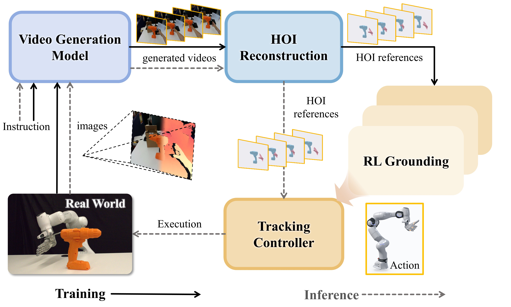

<h1 align="center">GALATEA: Grounding Generated Video Plans in Simulation Towards Versatile Dexterous Controllers</h1>

  <a href="https://tianyueh8erobot.github.io/">Tianyue Wu</a>2,3,1,*,‡,
  <a href="https://boyuan-an.github.io/">Boyuan An</a>2,1,*,
  <a href="https://zhao-sq.github.io/">Shuqi Zhao</a>1,
  <a href="https://github.com/GuoHeyu">Heyu Guo</a>2,
  <a href="https://wlxing1901.github.io/">Wanli Xing</a>2,
   
  <a href="https://people.eecs.berkeley.edu/~yima/">Yi Ma</a>3,1,
  <a href="https://openreview.net/profile?id=%7EKaifeng_Zhang1">Kaifeng Zhang</a>2,
  <a href="https://warshallrho.github.io/">Ruihai Wu</a>1,†,
  <a href="https://me.berkeley.edu/people/masayoshi-tomizuka/">Masayoshi Tomizuka</a>1,†

  1UC Berkeley &nbsp;&nbsp; 2Sharpa &nbsp;&nbsp; 3The University of Hong Kong
   
  *Equal contribution &nbsp;&nbsp; †Co-advisors &nbsp;&nbsp; ‡Corresponding author

<h3 align="center">
  <a href="https://boyuan-an.github.io/GALATEA/resources/GALATEA_paper.pdf">📄 Paper</a> |
  <a href="https://boyuan-an.github.io/GALATEA/">🌐 Project Page</a>
</h3>

  

## TL;DR

Video generation as reference data to train RL dexterous controller when training, and as motion planner executed by the tracker when deploying.

## Abstract

Generated hand–object interaction videos provide a controllable way to propose manipulation motions. **GALATEA** combines generated videos with simulation-based HOI grounding: generated videos provide diverse motion references for learning a multi-object, multi-trajectory HOI tracker, while at deployment time video models produce motion plans that are executed by the learned tracker. With minimal manual intervention, the reconstruction pipeline yields approximately 2,000 usable references from 2,500 generated clips, of which more than 1,500 trajectories are grounded in simulation. In closed-loop real-world experiments, the distilled controller performs functional grasps, non-prehensile manipulation, and post-grasp object-pose tracking.

---

## 📋 TODO

We will publicly release both items below **before November 2026**.

- [ ] Release the reinforcement-learning tracking code and example datasets.
- [ ] Release the HOI reconstruction code and example generated videos, together with their prompts.
